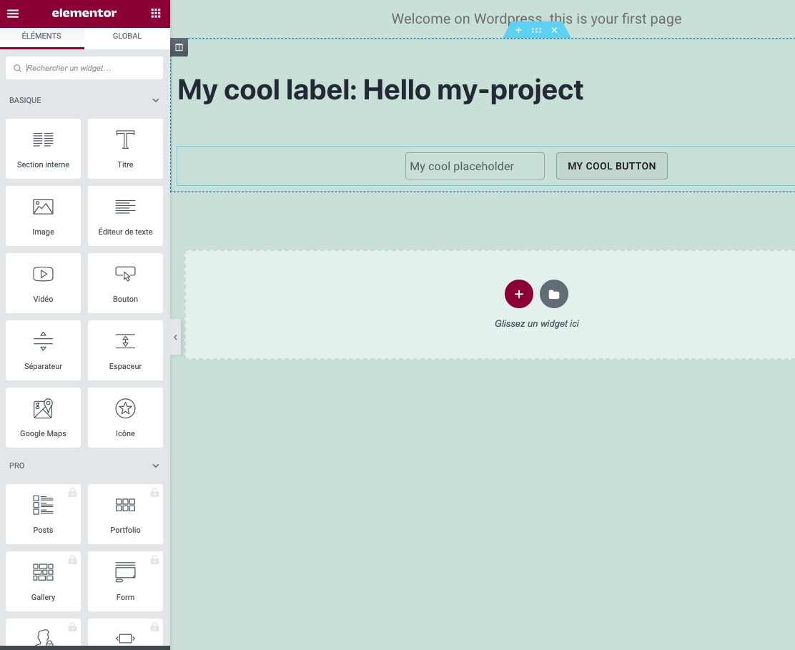

# Nx ReactJS elementor widgets

Nx plugin to generate Wordpress plugin that enrich Elementor with ReactJS widgets.
All widget are wrapped in web component that will act as a proxy between elementor and react.
all web components uses shadow dom to prevent css overload.

State between component is maintained using Redux.

## Plugins

| Plugin                                                                                                                    | Description                                             |
| ------------------------------------------------------------------------------------------------------------------------- | ------------------------------------------------------- |
| [`@betrue/react-elementor`](https://github.com/betrueagency/nx-reactjs-elementor/tree/main/e2e/react-elementor-e2e)    | Generate Reactjs Elementor widgets in Wordpress plugin; |

## Install

Create a new nx workspace (if doesn't exist)

`npx create-nx-workspace@latest my-workspace`

Install [`@betrue/react-elementor`](https://www.npmjs.com/package/@betrue/react-elementor)

     cd my-workspace
     npm install -D @betrue/react-elementor

## Usage

Create a new plugin

    nx g @betrue/react-elementor:plugin my-project

this generates starting code base made up of two react components (input from and display title) wrapped into elementor widgets.

if you already have and Wordpress instance with elementor installed, you juste need to build the wordpress plugin

     nx elementor my-project

Zip and upload using Wordpress plugin management the content of `dist/element/my-project`. that's all you can now try to use theses widgets into elementor :)

You can also serve the app to see the generated web component in action on [`http://localhost:4200`](http://localhost:4200)

    nx serve my-project

## Try it using docker

If you have already installed docker and docker-compose you can try the elementor plugin in wordpress

    nx elementor my-project // to build the plugin     `      

start docker-compose

    docker-compose -f apps/my-project/src/docker-compose.yml up -d

* open your browser on [`http://localhost:8000`](http://localhost:8000)
* Login into Wordpress admin and [`install and enable elementor `](http://localhost:8000/wp-admin/plugins.php?s=elementor&plugin_status=all)
* Enable your custom [`elementor plugin`](http://localhost:8000/wp-admin/plugins.php)  plugin.
* Create a [`new page`](http://localhost:8000/wp-admin/post-new.php?post_type=page) and choose edit with elementor.
* Search and add `my-project-title` and `my-project-input` widgets to your page.

### Add a new widget to an existing plugin:

    nx g @betrue/nx-reactjs-elementor:addWidget --name my-widget --plugin my-plugin --attributes attr1,attr2

| Option                          | Description                                                                        |
| ------------------------------- | -------------------------------------------------------                            |
| `name`                          | (Required) name of the Reactjs elementor widget                                    |
| `plugin`                        | (Required) The name of the Wordpress plugin in which the widget will be generated. |
| `attributes`                    | List of attribute that are customizable in elementor                               |
| `directory`                     | A directory where the project is placed (sub-directory in lib).                    |
| `author`                        | Name of who makes this plugin.                                                     |
| `tags`                          | Add tags to the project (used for linting).                                        |
| `widgetDescription`             | Widget description that appear in Wordpress plugin view.                           |
| `version`                       | Wordpress plugin version.                                                          |

## Maintainer

- [https://betrue.fr/](https://www.betrue.fr/) 
